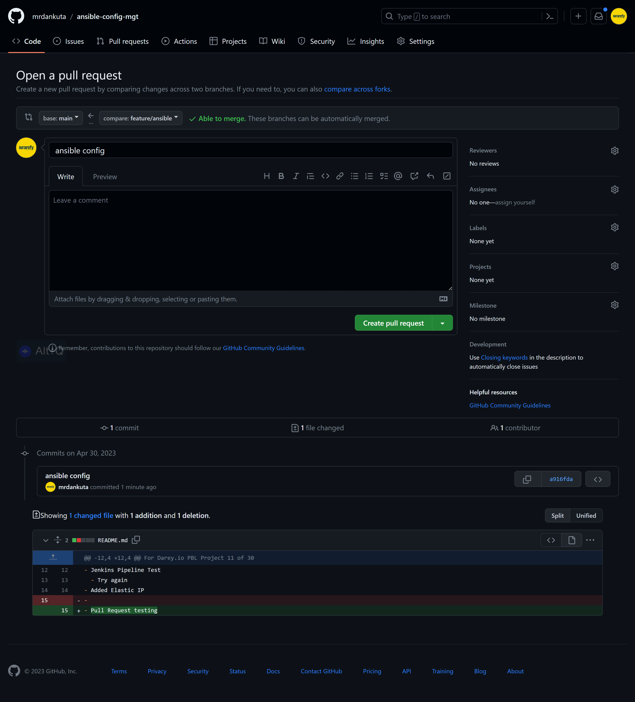

# Project 11 - Ansible – Automate Project 7 to 10

*Final code can be found here: https://github.com/mrdankuta/ansible-config-mgt*

---

## Step 1 - Install & Configure Ansible
- Rename `jenkins` server name tag from previous projects to `jenkins-ansible` in EC2.
- Allocate new Elastic IP and associate to `jenkins-ansible` server to persist IP Address.
- Install `Ansible`:
  ```
  sudo apt update
  sudo apt install ansible
  ```
- Check `ansible` version to confirm installation: 
  ```
  ansible --version
  ```
  

  ## Step 2 - Configure Jenkins Server to copy file to NFS server via SSH

- Goto Jenkins Dashboard `http://<jenkins-server-public-elastic-ip-address>:8080` in browser to begin Jenkins configuration
- Create new job/project. Give it a name `ansible`, select `Freestyle project` and click `ok`
    
- Connect jenkins project to Github repository via Webhook by adding `http://<jenkins-server-public-elastic-ip-address>:8080/github-webhook/` as the payload URL in Settings -> Webhook in Github repository
    
- In Jenkins project, under configuration -> Source Code Management, select `Git`, enter Github repository URL and credentials, save. **_Remember to ensure branch matches the github branch to be operated on._**
    
- Configure automatic triggering from Github Webhook
    
- Configure all build files to be archived
  
- Goto project configuration -> Post-build Actions -> Add `Send build artifacts over SSH` -> Select NFS server connection added in previous step -> Enter `**` in Source files field to transfer all artifacts
    
- Test automation by editing file(s) in repository and push the changes.
  


## Step 3 - Configure Ansible Inventory & Playbooks

- Setup SSH Agent for Ansible to connect via SSH to target servers. Use `ssh-add` to add private keys.
  ```
  eval `ssh-agent -s`
  ssh-add <path/to/private/key>
  ssh-add -l
  ssh -A user@<ansible-server-public-ip>
  ```
- Create a Git branch for new features in development which will be merged with the main branch later. Use `git checkout -b <new-branch-name>` to create a new branch and switch into it.
- Create Ansible files structure by creating new directories called `inventory` and `playbooks`
- Within the `playbooks` directory, create a YAML file called `common.yml`. This will be the first Ansible playbook.
- Within the `inventory` directory, create 4 YAML files. Each for the Development, Staging, Testing, and Production environments. Call them `dev.yml`, `staging.yml`, `uat.yml`, and `prod.yml`
  
- Outline the inventory available for Ansible to operate on in the `dev.yml` file.
  ```yml
  [nfs]
  <nfs-server-private-ip> ansible_ssh_user='ec2-user'

  [webservers]
  <webserver-1-server-private-ip> ansible_ssh_user='ec2-user'
  <webserver-2-server-private-ip> ansible_ssh_user='ec2-user'

  [db]
  <db-server-private-ip> ansible_ssh_user='ubuntu' 

  [lb]
  <lb-server-private-ip> ansible_ssh_user='ubuntu'
  ``` 
- Outline Ansible Playbook configurations for target servers in the `playbooks/common.yml` file
  ```yml
  ---
  - name: update web, nfs and db servers
    hosts: webservers, nfs
    remote_user: ec2-user
    become: yes
    become_user: root
    tasks:
      - name: ensure wireshark is at the latest version
        yum:
          name: wireshark
          state: latest

  - name: update LB server
    hosts: lb, db
    remote_user: ubuntu
    become: yes
    become_user: root
    tasks:
      - name: Update apt repo
        apt: 
          update_cache: yes

      - name: ensure wireshark is at the latest version
        apt:
          name: wireshark
          state: latest
  ```
- Commit code with `git add .`, `git commit -m "mesage"`, and `git push`
- In Github there will be a notification for a Pull Request. This is because the project has multiple branches and normally requires a review process before branches are merged with the main branch. Here, we will simulate the process and create a Pull Request.
  
- Review code changes.
  
- Create Pull Request
- 
- Merge Pull Request to main branch via the Github.com UI or in terminal by first switching to the `main` branch, merging the `feature` branch to the main, and pushing to Github.
  ```
  git checkout main
  git merge feature/ansible
  git push
  ```
  
  
- Once the code has been pushed to the `main` branch, the webhook shout automatically trigger Jenkins to begin its operations and send the artifact to the NFS server and is configired in this case.
  


## Run Ansible Playbooks
- In `jenkins-ansible` server execute the following command to run ansible playbook
  ```
  ansible-playbook -i path/to/inventory/dev.yml path/to/playbooks/common.yml
  ```
  
- Visit each server to confirm Ansible instructions were carried out. In this case the installation of Wireshark with `which wireshark`