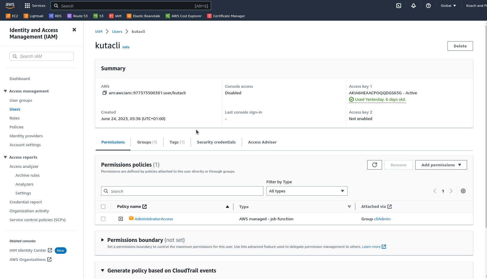

# AWS Cloud Solution Terraform Project Documentation
## IaC Implementation of [Project 15](https://github.com/mrdankuta/project-15-aws-cloud-solution) Part 1

_This is the first iteration of this code, and values will be hard coded at first. In subsequent iterations and refactoring, the project will be segmented into modules and variables will be used._

## AWS Cloud Solution Architecture


### Preparations
- Create an `IAM` user account that has full administrator access and programatic access. Best practice is to first create a user group with the neccessary Permission Policies attached to the group, then add the user to the group.
- Create and save access keys for programmatic access via AWS CLI
  
- Install `Boto3` and ensure Python is installed on the computer
- Install and configure AWS CLI in terminal
- Install Terraform with [tfenv](https://github.com/tfutils/tfenv)
  ```sh
  git clone --depth=1 https://github.com/tfutils/tfenv.git ~/.tfenv
  sudo ln -s ~/.tfenv/bin/* /usr/local/bin
  tfenv install 
  ```

### Begin Terraform Configuration
- Create and navigate to a new directory for this Terraform project.
- Create file `provider.tf` to specify provider configurations. Insert the following:
  ```
  provider "aws" {
    region = "us-east-1"
  }
  ```


### Setting up the VPC and Public Subnets
- Create another file `main.tf`. This will hold all configurations for now.
- Add the following block to create and manage the VPC resource:
  ```
  # Create VPS
  resource "aws_vpc" "part-unltd-vpc" {
    cidr_block                      = "10.0.0.0/16"
    enable_dns_support              = "true"
    enable_dns_hostnames            = "true"
    enable_classiclink              = "false"
    enable_classiclink_dns_support  = "false"
  }
  ```
- Run `terraform init` in the CLI to allow terraform install the required plugins and connect to the AWS account.
- Create the VPC by running `terraform plan` then `terraform apply` in CLI.

_**From here on out, execute `terraform plan` and `terraform apply` as often as the project is being built. This is to ensure that the infrastructure is being built properly. Due to Terraform's Idempotency feature, only changes will be applied. Also, with `terraform destroy` resources can be easily deprovisioned.**_

- Create the 2 public subnets required by the architecture:
  ```
  # Create public subnet1
  resource "aws_subnet" "public-subnet1-punltd"{
    vpc_id                  = "aws_vpc.part-unltd-vpc.id"
    cidr_block              = "10.0.1.0/24"
    map_public_ip_on_launch = true
    availability_zone       = "us-east-1a"
  }

  # Create public subnet2
  resource "aws_subnet" "public-subnet2-punltd"{
    vpc_id                  = "aws_vpc.part-unltd-vpc.id"
    cidr_block              = "10.0.2.0/24"
    map_public_ip_on_launch = true
    availability_zone       = "us-east-1b"
  }
  ```


### Refactoring the Code
- Begin refactoring the code written so far by introducing variable. Create a file `variables.tf` to declare all the variables to be used for now. Insert the following:
  ```
  variable "region" {
    default = "us-east-1"
  }
  
  variable "vpc_cidr" {
    default = "10.0.0.0/16"
  }

  variable "enable_dns_support" {
    default = "true"
  }

  variable "enable_dns_hostnames" {
    default = "true"
  }

  variable "enable_classiclink" {
    default = "false"
  }
  variable "enable_classiclink_dns_support" {
    default = "false"
  }

  ```
- Return to `provider.tf` and update the code to use the create variables:
  ```
  provider "aws" {
    region = var.region
  }
  ```
- Return to `main.tf` and update the code to use the create variables:
  ```
  # Create VPS
  resource "aws_vpc" "part-unltd-vpc" {
    cidr_block                      = var.vpc_cidr
    enable_dns_support              = var.enable_dns_support
    enable_dns_hostnames            = var.enable_dns_hostnames
    enable_classiclink              = var.enable_classiclink
    enable_classiclink_dns_support  = var.enable_classiclink_dns_support
  }
  ```

- Use Terraform's Data Sources feature to fetch the list of available Availability Zones in the region configured. Add the following above the subnet blocks:
  ```
  # Fetch list of Availability Zones
  data "aws_availability_zones" "az-list" {
    state = "available"
  }
  ```
- Use the data received to update the subnet blocks. Also use Terraform's `count` function to create the 2 subnets by invoking a loop, instead of declaring two blocks like was done earlier. Hence, delete one of the public subnet blocks and update the remaining one:
  ```
  # Create public subnets
  resource "aws_subnet" "public-subnet-punltd" {
    vpc_id                  = "aws_vpc.part-unltd-vpc.id"
    cidr_block              = "10.0.1.0/24"
    map_public_ip_on_launch = true
    count                   = 2
    availability_zone       = data.aws_availability_zones.az-list.names[count.index]
  }
  ```
- A `cidr_block` cannot be duplicated within a VPC. Hence the CIDR block in the subnets must be made dynamic for the configuration to work and be truly automated. 
- -  Use the `cidrsubnet()` function.
- -  Insert the VPC's CIDR range as the `prefix`.
- -  Number 8 as the `newbits`.
- -  Use `count.index` as the netnum.
- -  The paratmeters for the function are: `cidrsubnet(prefix, newbits, netnum)`
- -  The new entry will be thus: `cidr_block = cidrsubnet(var.vpc_cidr, 8 , count.index)`
- With regions having varying amounts of Availability Zones, this infrastructure will need some logic to:
- -  Allow for the desired number of subnets to be specified.
- -  Use the number of the desired subnets if the number specified to create the subnets in the available AZs
- -  Where no desired number is specified, can use the default of 2 to create subnets in 2 AZs.
- First, a variable will be declared for the desired number of subnets in the `variables.tf` file:
  ```
  variable "public-subnets-num" {
    default = 2
  }
  ```
- Return to the `main.tf` file and update the public subnet block by replacing the count value witha condition:
  ```
  resource "aws-subnet" "public-subnet-punltd" {
    vpc_id                  = "aws_vpc.part-unltd-vpc.id"
    cidr_block              = cidrsubnet(var.vpc_cidr, 8 , count.index)
    map_public_ip_on_launch = true
    count                   = var.public-subnets-num == null || var.public-subnets-num <= 0 || var.public-subnets-num > length(data.aws_availability_zones.az-list.names) - 1 ? length(data.aws_availability_zones.az-list.names) : var.public-subnets-num
    availability_zone       = data.aws_availability_zones.az-list.names[count.index]
  }
  ```
  - The count statement checks to see if the `public-subnets-num` variable has been set to `null` OR a `number equal to/less than 0` OR a `number greater than` the available AZs.
  - If true, then the number of subnets to be created will be equal to the number of available AZs. Thus creating one subnet in all AZs.
  - If false, that is, a valid number that is within the number of available AZs, then the specified number of subnets will be created.
- Now, create `terraform.tfvars` file where all the values for the variables will be specified.
  ```
  region = "us-east-1"
  vpc_cidr = "10.0.0.0/16" 
  enable_dns_support = "true" 
  enable_dns_hostnames = "true"  
  enable_classiclink = "false" 
  enable_classiclink_dns_support = "false" 
  preferred_number_of_public_subnets = 2
  ```
**Run `terraform plan` and `terraform apply` to create the VPC and Subnets in AWS and to ensure there are no errors.**