# Step 8 - Linus Practice Commands

```sh
sudo
```

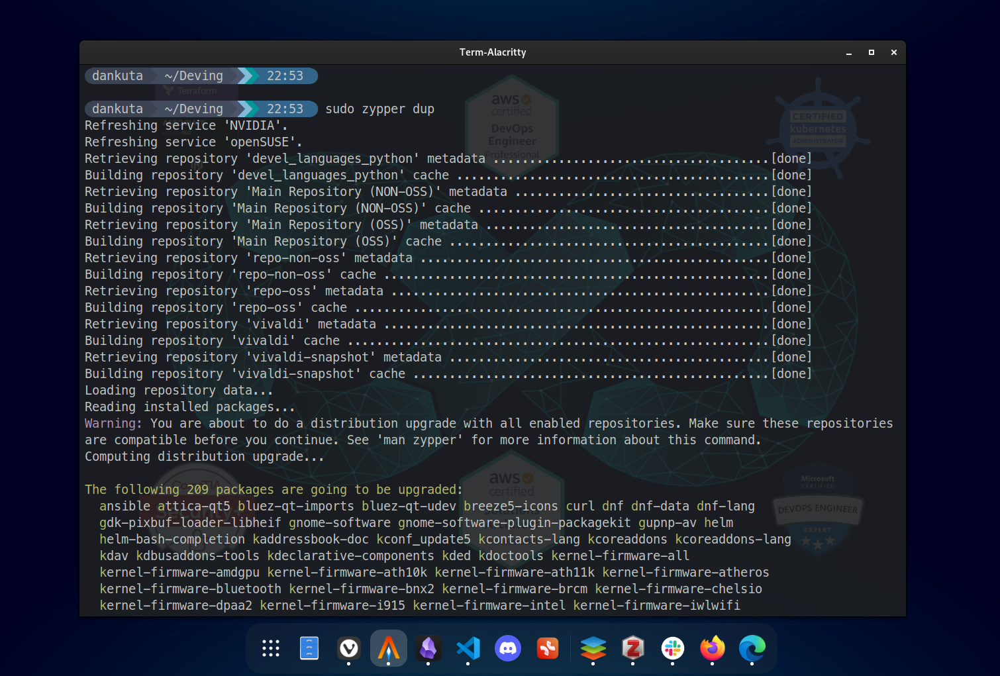

```sh
pwd
```

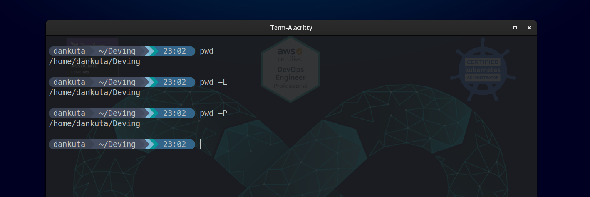

```sh
cd
```

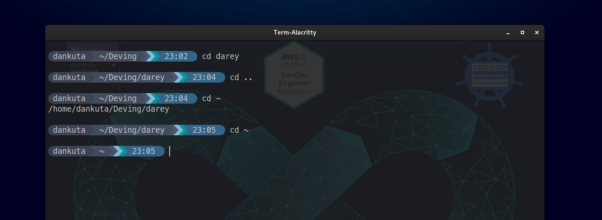

```sh
ls
```

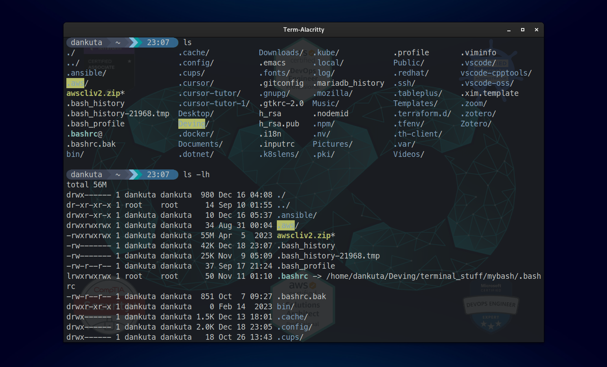

```sh
cat
tac
```

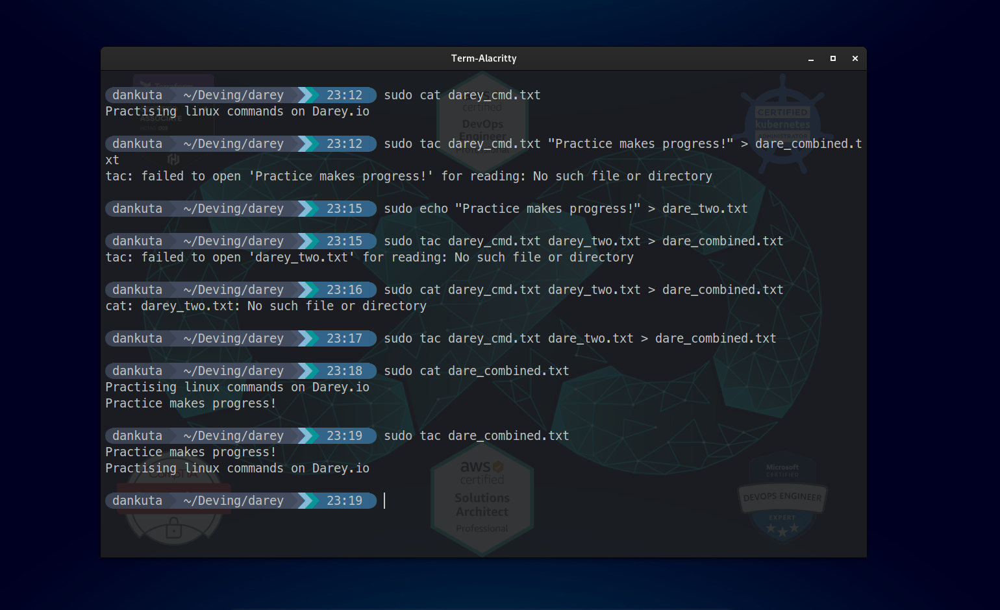

```sh
cp
```

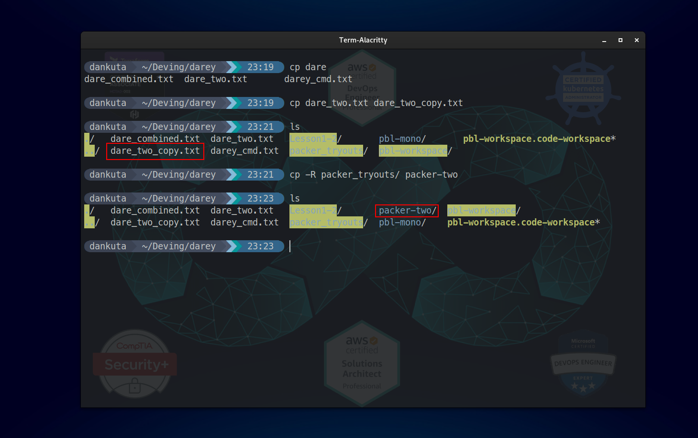

```sh
mv
```


```sh
mkdir
```

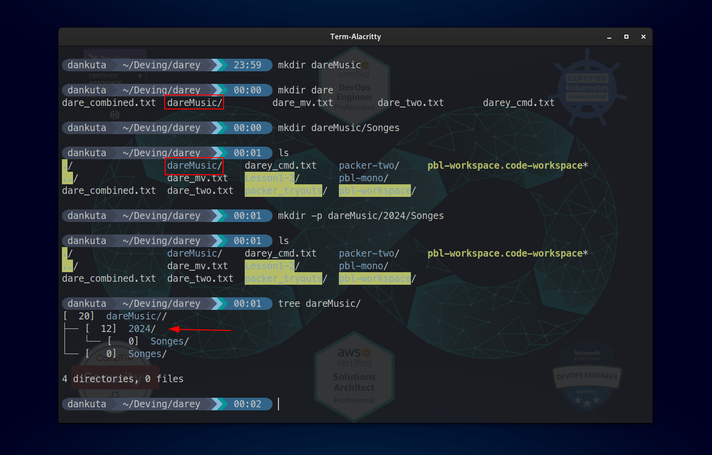

```sh
rmdir
```

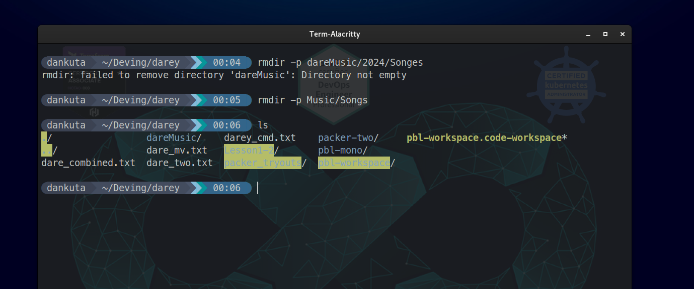

```sh
rm
```

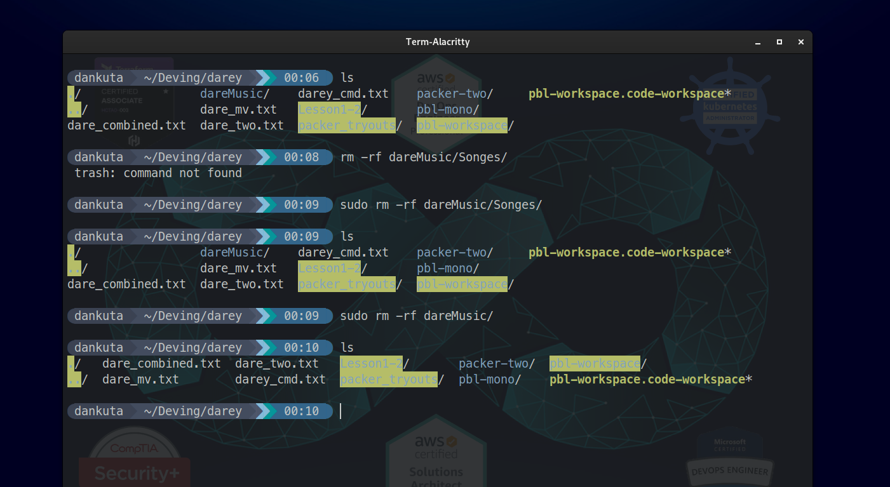

```sh
touch
```

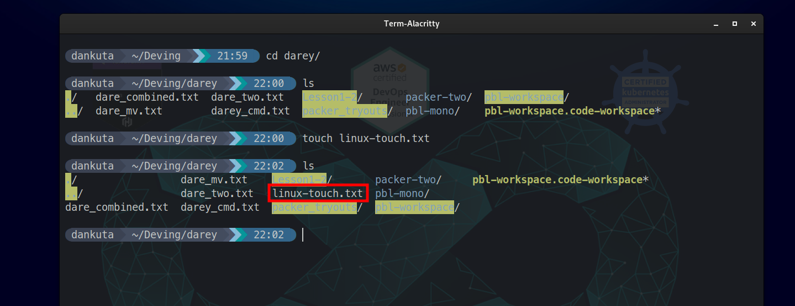

```sh
find
```

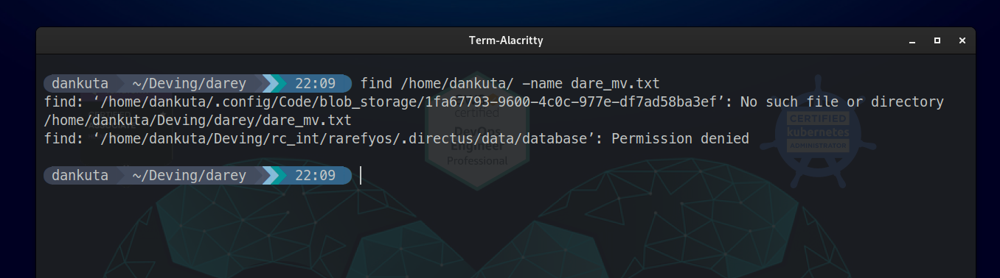
