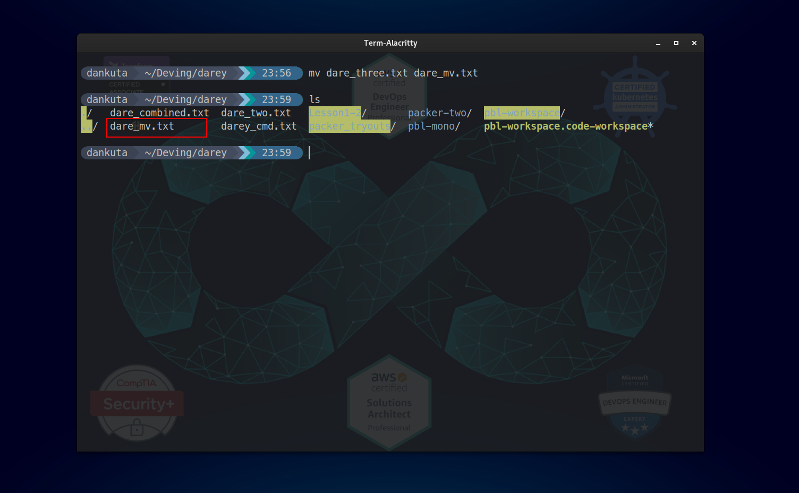

# Step 8 - Linus Practice Commands

```sh
sudo
```


```sh
pwd
```


```sh
cd
```


```sh
ls
```


```sh
cat
tac
```


```sh
cp
```


```sh
mv
```



```sh
mkdir
```


```sh
rmdir
```


```sh
rm
```


```sh
touch
```


```sh
find
```


