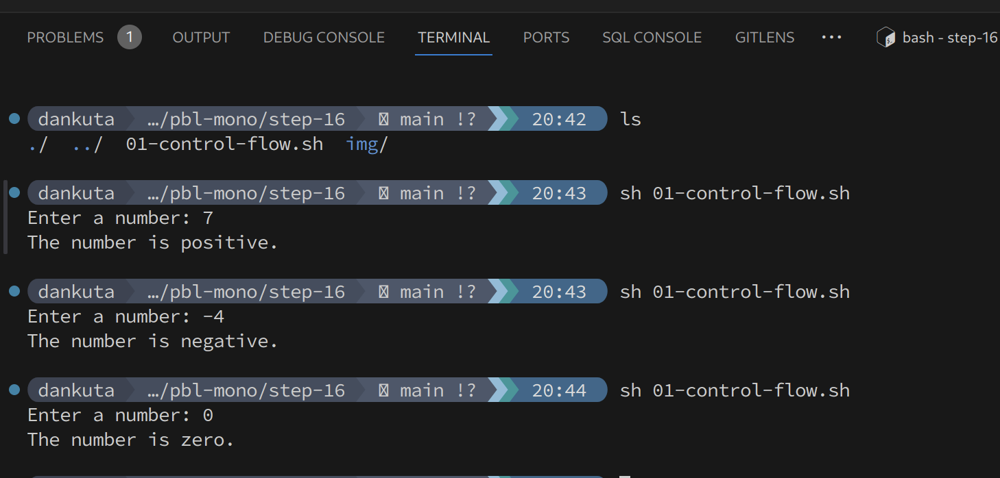
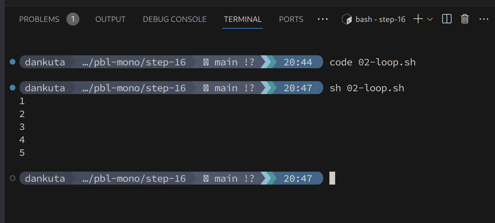
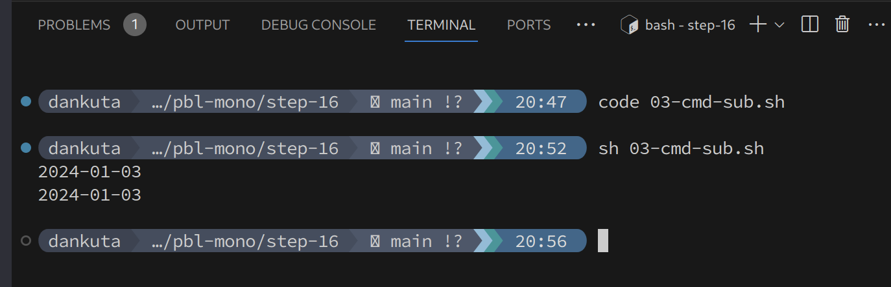
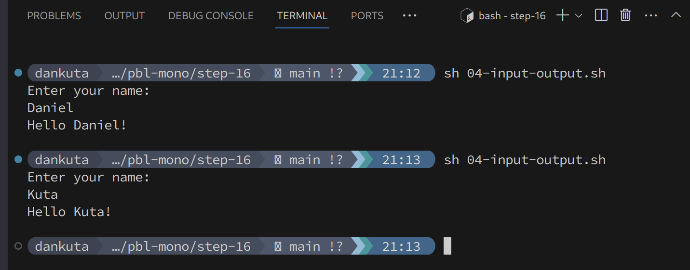
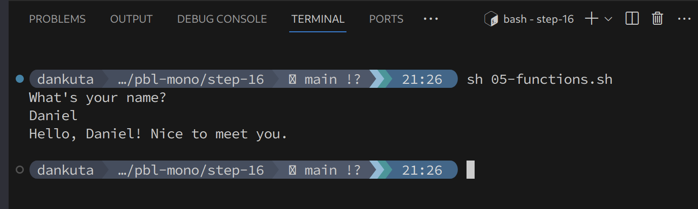
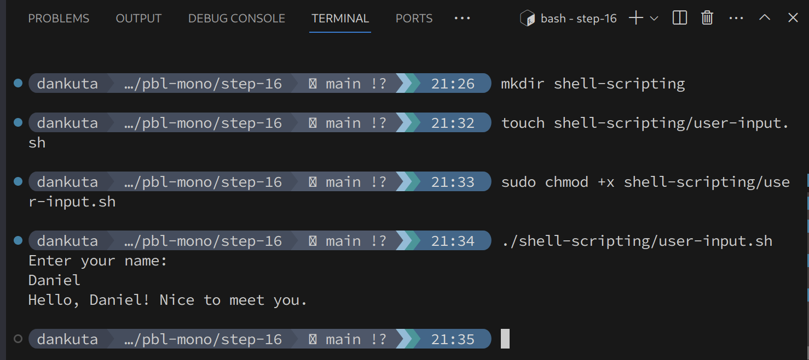
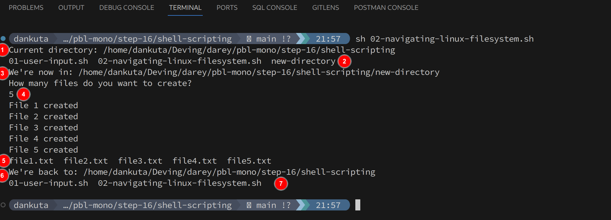
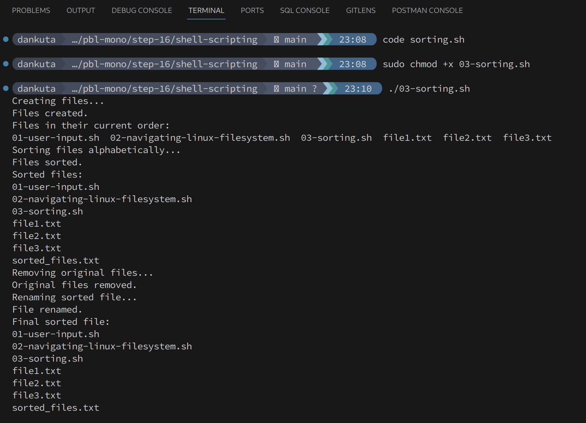
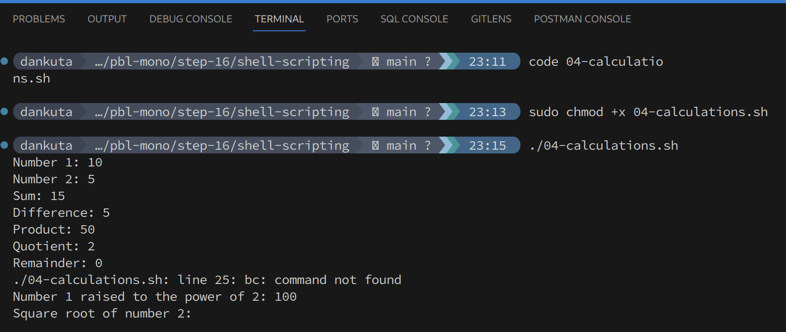
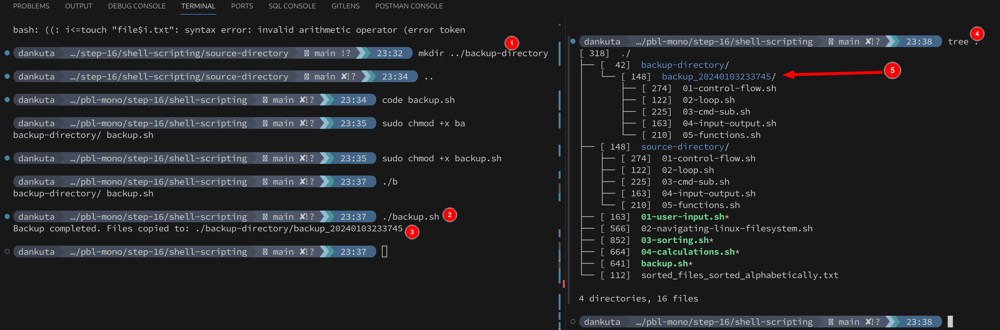

# Step 16 - Bash Scripting Practice

## Control Flow

Shell scripts allow for control flow statements like if-else and case statements to execute code conditionally. The example code demonstrates using an if-elif-else statement to check if a number entered by the user is positive, negative, or zero. The if statement checks if the number is greater than 0 and prints a message that it is positive. The elif statement checks if the number is less than 0 and prints that it is negative. Finally, the else statement catches if the number is 0 and prints it is zero. This control flow allows the script to execute different logic depending on the input condition. If-else statements are fundamental to controlling logic flow in shell scripts.

```shell
#!/bin/bash

read -p "Enter a number: " num

if [ $num -gt 0 ]; then
    echo "The number is positive."
elif [ $num -lt 0 ]; then
    echo "The number is negative."
else
    echo "The number is zero."
fi

```


## Loops

The example code demonstrates a for loop in Bash to print numbers from 1 to 5. The for loop sets a variable i to 1, tests that i is less than or equal to 5, and increments i by 1 each iteration. This allows repeating a code block a set number of times, which is a fundamental concept for loops in shell scripting.

```shell
#!/bin/bash

for (( i=1; i<=5; i++ ))
do
    echo $i
done

```



## Command Substitution

The example demonstrates command substitution in Bash using both backticks and $() syntax. This allows storing the output of a command in a variable for later use in the script. Command substitution is useful for capturing the result of a command to manipulate or output.

```shell
#!/bin/bash

current_date_backtick=`date +%Y-%m-%d`

echo $current_date_backtick

current_date=$(date +%Y-%m-%d)

echo $current_date
```



## Input & Output

The example shows reading user input with read and writing output with echo. The user's name is read into the $name variable and echoed out with a greeting. This is piped to a file, demonstrating basic input and output in Bash - reading input, manipulating variables, and writing output.

```shell
#!/bin/bash

echo "Enter your name:"
read name

echo "Hello $name!" > index.txt

cat index.txt
```



## Functions

The code defines a function called greet that prints a greeting message. The function is called by passing the user's name. Functions allow reusable code blocks to be defined once and called multiple times. This is a basic example of how functions work in Bash shell scripts.

```shell
#!/bin/bash

# Define a function to greet the user
greet() {
    echo "Hello, $1! Nice to meet you."
}

# Call the greet function and pass the name as an argument
echo "What's your name?"
read name
greet $name

```



## User Input

The example demonstrates reading user input in a Bash shell script. The script prompts the user to enter their name using echo and read. The read command assigns the entered value to the $name variable. The name is then interpolated into a greeting string that is output. Reading user input allows interactivity in shell scripts.

```shell
#!/bin/bash

# Prompt the user for their name
echo "Enter your name:"
read name

# Display a greeting with the entered name
echo "Hello, $name! Nice to meet you."

```



## Navigating Linux

The script demonstrates common commands for navigating the Linux filesystem in Bash - `pwd`, `ls`, `mkdir`, `cd`, `rmdir`. It shows creating and moving between directories, listing contents, creating files, and deleting directories. Shell scripts excel at automating these types of filesystem operations.

View full example code in [./shell-scripting/02-navigating-linux-filesystem.sh](shell-scripting/02-navigating-linux-filesystem.sh)



## Sorting

The example shows sorting file contents alphabetically in Bash using sort and output redirection. It creates sample files, sorts them, removes the originals, renames the sorted file, and outputs the result. Sorting is a common task automated in shell scripts.


View full example code in [./shell-scripting/03-sorting.sh](shell-scripting/03-sorting.sh)



## Calculations

The script shows arithmetic operations in Bash using `$(( ))` for basic math and `bc` for more advanced operations. Variables store numeric values which are combined mathematically and output. Shell scripts allow automating numeric calculations.

View full example code in [./shell-scripting/04-calculations.sh](shell-scripting/04-calculations.sh)



## Backups

The script demonstrates backing up files in Bash by defining source and destination directories, creating a timestamp, making a backup folder, and copying files. Automating backups is a common use case for shell scripts.

```shell
#!/bin/bash

# Define the source directory and backup directory
source_dir="./source-directory"
backup_dir="./backup-directory"

# Create a timestamp with the current date and time
timestamp=$(date +"%Y%m%d%H%M%S")

# Create a backup directory with the timestamp
backup_dir_with_timestamp="$backup_dir/backup_$timestamp"

# Create the backup directory
mkdir -p "$backup_dir_with_timestamp"

# Copy all files from the source directory to the backup directory
cp -r "$source_dir"/* "$backup_dir_with_timestamp"

# Display a message indicating the backup process is complete
echo "Backup completed. Files copied to: $backup_dir_with_timestamp"
```

