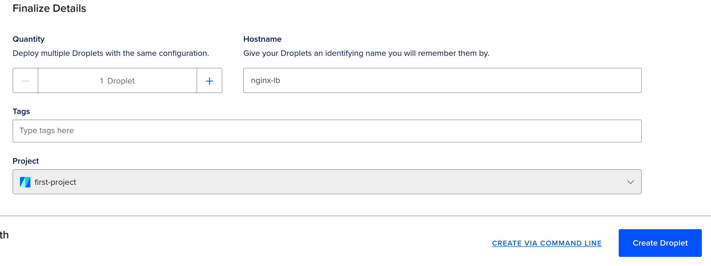

# Step 19 - Implementing Loadbalancers with Nginx

## Introduction

This project demonstrates how to set up a simple load balancer using Nginx to distribute traffic across multiple backend servers. The goal is to build a highly available and scalable web application architecture.

The project involves provisioning two Ubuntu servers running Apache to serve as the backend application servers. These are configured to listen on port 8000.

A third Ubuntu server running Nginx is then provisioned to act as the load balancer. The Nginx server is configured to listen on port 80 and proxy traffic to the two backend servers in a round robin fashion.

Some key aspects of the project include:

- Setting up the backend Apache servers with custom index pages
- Configuring Nginx as a reverse proxy to distribute requests
- Defining backend server groups in Nginx for load balancing
- Testing Nginx configuration and restarting to apply changes
- Verifying load distribution by refreshing the load balancer IP

This provides a straightforward implementation of using Nginx as a load balancer for web applications. The result is a highly available architecture that can handle more traffic by scaling horizontally.

## What is a loadbalancer?

A load balancer is a device or software that distributes network traffic across multiple servers. The goal is to optimize resource use, maximize throughput, minimize response time, and avoid overload on any one server.

Nginx is a popular open source web server that can also function as a very efficient load balancer. Nginx has features that make it well suited for load balancing, including:

- Reverse proxying - Nginx can accept requests and pass them to backends as if it were the origin server. This allows Nginx to split traffic across multiple backends transparently to clients.
- Load balancing algorithms - Nginx has several methods like round robin, least connections, IP hash, etc to distribute requests evenly across backends.
- Health checks - Nginx periodically checks backend server health and will stop sending traffic to unhealthy hosts. This maximizes uptime.
- Session persistence - Nginx can send all requests from a client to the same backend server. This is useful for applications that expect session stickiness.
- TLS/SSL offloading - Nginx can handle TLS encryption/decryption instead of the backend servers, reducing their load.

Nginx is lightweight, fast, and very configurable, making it a popular choice for load balancing web applications and APIs. Setting it up as a load balancer allows traffic to be distributed efficiently across multiple backend servers.

## Provisioning & configuring the target servers

- Provision 2 servers running Ubuntu 22.04

- Attach an SSH key to each of the servers

- Open ports `8000` for inbound traffic on both servers

- Install Apache webserver on both servers. On each server, run the following commands:

```bash
sudo apt update -y &&  sudo apt install apache2 -y
```

- Verify that Apache is running on both servers by running:

```bash
sudo systemctl status apache2
```


- Configure Apache to listen on port `8000` by editing the file `/etc/apache2/ports.conf`:

```bash
sudo vi /etc/apache2/ports.conf
```

- Add the following line to the file:

```bash
Listen 8000
```


- Open `/etc/apache2/sites-available/000-default.conf` and change port 80 to 8000 on the `<virtualHost *:80>` section:

```bash
sudo vi /etc/apache2/sites-available/000-default.conf
```


- Save and close the file by pressing `esc` key and entering the following command:

```bash
!wqa
```

- Restart Apache to apply the changes:

```bash
sudo systemctl restart apache2
```

- Create a file named `index.html` on both servers with `sudo vi index.html` and insert the following content:

```html
<!DOCTYPE html>
<html>
    <head>
        <title>My LoadBalancer Project</title>
    </head>
    <body>
        <h1>Welcome to my LoadBalancer Project</h1>
        <p>Public IP: INSERT_THE_PUBLIC_IP_OF_THIS_SERVER_HERE</p>
    </body>
</html>
```

- Change ownership of the file to `www-data` by running:

```bash
sudo chown www-data:www-data ./index.html
```

- Replace the default Apache page with the one we just created by running:

```bash
sudo cp -f ./index.html /var/www/html/index.html
```

- Restart Apache to apply the changes:

```bash
sudo systemctl restart apache2
```

- Open the `PUBLIC_IP:8000` of each target server in a browser and verify that the page is displayed correctly


## Provisioning & configuring the Nginx loadbalancer

- Provision a third server running Ubuntu 22.04

- Attach an SSH key to the third server
- Ensure port `80` is open for inbound traffic on the third server

- Install Nginx on the third server by running:

```bash
sudo apt update -y &&  sudo apt install nginx -y
```

- Verify that Nginx is running on the third server by running:

```bash
sudo systemctl status nginx
```


- Open Nginx configuration file by running:

```bash
sudo vi /etc/nginx/conf.d/loadbalancer.conf
```

- Add the following content to the file:

```nginx
upstream backend_servers {

    # your are to replace the public IP and Port to that of your webservers
    server TARGET_SERVER_PUBLIC_IP:8000; # public IP and port for webserser 1
    server TARGET_SERVER_PUBLIC_IP:8000; # public IP and port for webserver 2

}

server {
    listen 80;
    server_name LB_SERVER_PUBLIC_IP; # provide your load balancers public IP address

    location / {
        proxy_pass http://backend_servers;
        proxy_set_header Host $host;
        proxy_set_header X-Real-IP $remote_addr;
        proxy_set_header X-Forwarded-For $proxy_add_x_forwarded_for;
    }
}
```


> The purpose of this Nginx configuration file is to set up the Nginx server as a load balancer that will distribute incoming requests across two backend web servers.
>
> It takes no direct inputs. The main output is the Nginx server listening on port 80 and proxying requests to the backend servers.
>
> It achieves load balancing by:
>
> - Defining an upstream group called backend_servers that contains the IP addresses and ports of the two backend web servers.
>  
> - Configuring a server block that listens on port 80 and handles all incoming requests.
>
> - Using the proxy_pass directive to forward all requests to the backend_servers upstream group. This distributes the requests across the two backends.
>
> - Setting various proxy headers like Host, X-Real-IP, and X-Forwarded-For to pass key data about the original request to the backend servers.
>
> In summary, this Nginx configuration sets up a simple load balancer by defining the backend servers, configuring a main server to accept requests, and proxying those requests to the backends in a round-robin fashion. The result is that traffic is distributed evenly across the two web servers for better performance and redundancy.

- Save and close the file by pressing `esc` key and entering the following command:

```bash
!wqa
```

- Test the Nginx configuration by running:

```bash
sudo nginx -t
```


- Restart Nginx to apply the changes, if the test is successful:

```bash
sudo systemctl restart nginx
```

- Open the `LB_SERVER_PUBLIC_IP` in a browser and verify that the page is displayed correctly. Refresh the page multiple times to verify that the load balancer is distributing the requests across the two web servers.

