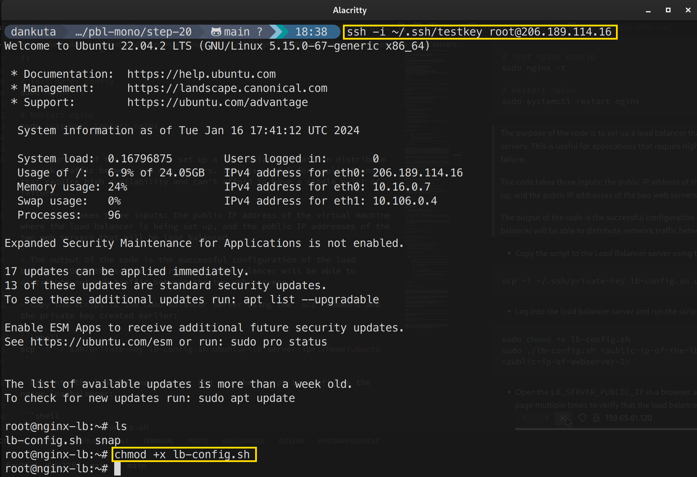

# Step 20 - Automating the Implementation of Loadbalancers with Nginx using Shell Scripts

> *This is a continuation of the previous step, [Step 19 - Implementing Loadbalancers with Nginx](https://github.com/mrdankuta/dareyio-projects-mono/blob/main/step-19/step19.md)*

## Introduction

In this step, we will create a shell script that will automate the configuration of the target webservers and the Nginx loadbalancer.

## Provisioning & configuring the target servers

- Provision 2 servers running Ubuntu 22.04

- Attach an SSH key to each of the servers

- Open ports `8000` for inbound traffic on both servers

- Create a file called `webservers-config.sh` to be used to configure the servers and insert the following code:

```bash
#!/bin/bash

# debug mode - enables debug output
set -x

# exit the script if there is an error - stops the script if any command fails
set -e

# exit the script when there is a pipe failure - stops the script if any part of a pipe fails
set -o pipefail

# get the public IP passed as an argument
PUBLIC_IP=$1

# check if public IP is empty, print message and exit if so
[ -z "${PUBLIC_IP}" ] && echo "Please pass the public IP of your virtual machine as an argument to the script" && exit 1

# update packages and install apache
sudo apt update -y &&  sudo apt install apache2 -y

# check apache status
sudo systemctl status apache2

if [[ $? -eq 0 ]]; then # if apache is running
    # set permissions to change ports.conf
    sudo chmod 777 /etc/apache2/ports.conf

    # change listen port to 8000
    echo "Listen 8000" >> /etc/apache2/ports.conf

    # set permissions to change apache config
    sudo chmod 777 -R /etc/apache2/

    # change virtual host port to 8000
    sudo sed -i 's/<VirtualHost \*:80>/<VirtualHost *:8000>/' /etc/apache2/sites-available/000-default.conf
fi

# set permissions on web root folder
sudo chmod 777 -R /var/www/

# create index.html file
echo "<!DOCTYPE html>
        <html>
        <head>
            <title>My Auto LoadBalancer Project</title> 
        </head>
        <body>
            <h1>Welcome to my Auto LoadBalancer Project</h1>
            <p>Public IP: "${PUBLIC_IP}"</p> 
        </body>
        </html>" > /var/www/html/index.html # save content to index.html

# restart apache
sudo systemctl restart apache2
```

> The purpose of this code is to configure an Apache web server on a virtual machine with a public IP address. The code updates the package lists for the machine, installs Apache, and then modifies the Apache configuration to listen on port 8000 instead of the default port 80. The code also creates a simple HTML page that displays a welcome message and the public IP address of the machine.
>
> The code takes one input, which is the public IP address of the virtual machine. This IP address is passed to the script as an argument when it is run.
>
> The output of the code is the successful configuration of the Apache web server and the creation of the HTML page. The HTML page can be accessed by navigating to the IP address and port number of the machine in a web browser.

- Copy the script to the target servers using the `scp` command and the private key created earlier:

```shell
scp -i ~/.ssh/private-key webservers-config.sh ubuntu@<target-server-ip>:/home/ubuntu
```


- Log into each of the target servers and run the script to configure them:

```shell
sudo chmod +x webservers-config.sh
sudo ./webservers-config.sh <public-ip-of-this-current-server>
```


## Provisioning & configuring the Nginx loadbalancer

- Provision a third server running Ubuntu 22.04

- Attach an SSH key to the third server
- Ensure port `80` is open for inbound traffic on the third server

- Create a file called `lb-config.sh` to be used to configure the Nginx loadbalancer and insert the following code:

```bash
#!/bin/bash

# Public IP passed as first argument
PUBLIC_IP=$1

# First webserver IP and port passed as second argument
firstWebserver=$2 

# Second webserver IP and port passed as third argument
secondWebserver=$3

# Check if Public IP argument is empty
[ -z "${PUBLIC_IP}" ] && echo "Please pass the Public IP of your virtual machine as the argument to the script" && exit 1

# Check if first webserver argument is empty
[ -z "${firstWebserver}" ] && echo "Please pass the Public IP together with its port number in this format: 127.0.0.1:8000 as the second argument to the script" && exit 1

# Check if second webserver argument is empty 
[ -z "${secondWebserver}" ] && echo "Please pass the Public IP together with its port number in this format: 127.0.0.1:8000 as the third argument to the script" && exit 1 

# Enable debug mode
set -x

# Exit script if any command fails
set -e

# Exit script if any part of pipe fails
set -o pipefail


# Update packages and install nginx
sudo apt update -y && sudo apt install nginx -y

# Check nginx status
sudo systemctl status nginx

if [[ $? -eq 0 ]]; then # If nginx installed successfully
    # Create load balancer config file
    sudo touch /etc/nginx/conf.d/loadbalancer.conf

    # Set permissions on config file
    sudo chmod 777 /etc/nginx/conf.d/loadbalancer.conf

    # Set permissions on nginx directory
    sudo chmod 777 -R /etc/nginx/

    
    echo " upstream backend_servers { # Define upstream block for backend servers

            # your are to replace the public IP and Port to that of your webservers
            server  "${firstWebserver}"; # public IP and port for webserser 1 
            server "${secondWebserver}"; # public IP and port for webserver 2

            } # Close upstream block

            server { # Open main server block
            listen 80; # Listen on port 80
            server_name "${PUBLIC_IP}"; # Set server name to Public IP

            location / { # Location block to handle all requests
                proxy_pass http://backend_servers; # Proxy requests to backend servers  
            } 
    } " > /etc/nginx/conf.d/loadbalancer.conf # Save config file
fi 

# Test nginx config
sudo nginx -t

# Restart nginx
sudo systemctl restart nginx
```

> The purpose of the code is to set up a load balancer that can distribute network traffic between two web servers. This is useful for applications that require high availability and can't afford to have a single point of failure.
>
> The code takes three inputs: the public IP address of the virtual machine where the load balancer is being set up, and the public IP addresses of the two web servers that will be load balanced.
>
> The output of the code is the successful configuration of the load balancer. Once the script has run, the load balancer will be able to distribute network traffic between the two web servers.

- Copy the script to the Load Balancer server using the `scp` command and the private key created earlier:

```shell
scp -i ~/.ssh/private-key lb-config.sh ubuntu@<lb-server-ip>:/home/ubuntu
```


- Log into the load balancer server and run the script to configure the nginx loadbalancer:

```shell
sudo chmod +x lb-config.sh
sudo ./lb-config.sh <public-ip-of-the-lb-server> <public-ip-of-webserver-1> <public-ip-of-webserver-2>
```




- Open the `LB_SERVER_PUBLIC_IP` in a browser and verify that the page is displayed correctly. Refresh the page multiple times to verify that the load balancer is distributing the requests across the two web servers.
